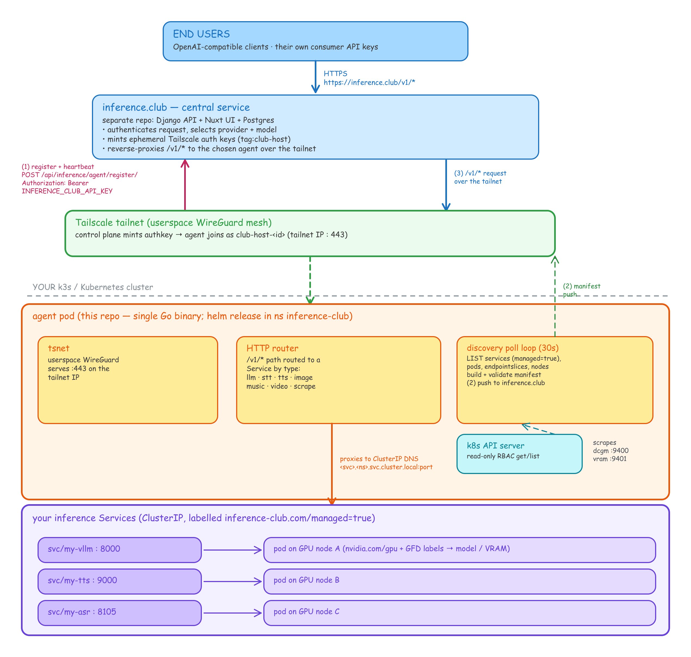

# inference-club-agent

**Register the LLMs running in your home Kubernetes cluster with
[inference.club](https://inference.club) and make them available over the
internet to anyone you grant access — `helm install` and a label.**

This is the home-side agent. It runs **inside your k3s / Kubernetes cluster**,
discovers the inference Services you've labelled `inference-club.com/managed=true`,
joins inference.club's private Tailscale network via embedded
[`tsnet`](https://tailscale.com/kb/1244/tsnet), and reverse-proxies an
OpenAI-compatible `/v1/*` surface to those Services over cluster DNS.

**No Tailscale account, no port forwarding, no public URL on your end.** The
agent dials *out* to inference.club using your account API key; the central
service mints an ephemeral Tailscale auth key and ships it back, cached so you
only need the API key on first run. The central service (Django + Nuxt) lives in
a separate repo — [`inference.club`](https://github.com/briancaffey/inference.club).
This repo is *only* the agent.

> **Setting this up with an AI assistant?** Point it at [`AGENTS.md`](./AGENTS.md)
> — a self-contained runbook. Installing the chart: [chart README](./charts/inference-club-agent/README.md).
> Labelling your Services: [Kubernetes discovery guide](./docs/kubernetes-discovery.md).

---

## Architecture



*Editable source: [`docs/architecture.excalidraw`](docs/architecture.excalidraw) — open it at [excalidraw.com](https://excalidraw.com) to tweak and re-export.*

**Three independent flows**, numbered above:

1. **Register / heartbeat** — the agent POSTs to inference.club with your API key
   as a Bearer token; the central service mints a tailnet auth key, creates/updates
   your `Provider`, and returns it. The agent caches the key and joins the tailnet.
2. **Discovery push** — a read-only poll loop LISTs the cluster (Services labelled
   `managed=true`, their backing Pods, EndpointSlices, and Nodes), assembles a
   validated manifest, and pushes it only when the bytes change. GPU facts come
   from node labels; live VRAM/util from optional `dcgm-exporter`/`vram-reporter`.
3. **Inference** — anyone you've granted access (configurable in the
   [inference.club dashboard](https://inference.club/dashboard)) hits
   `https://api.inference.club/v1/*` with *their* keys; the central service routes
   over the tailnet to your agent, which proxies to the right Service by `type`
   over cluster DNS. No inbound port on your side.

---

## Quickstart

You need: a Kubernetes cluster (k3s is the reference target) with at least one
OpenAI-compatible inference server already running **as a Service**, and an
inference.club API key from https://inference.club/dashboard.

```bash
# 1. Namespace the agent runs in and watches.
kubectl create namespace inference-club

# 2. Store your API key as a Secret (keeps it out of values files & history).
kubectl -n inference-club create secret generic inference-club-api-key \
  --from-literal=api-key=ic_live_xxxxxxxxxxxxxxxxxxxxxxxx

# 3. Install the agent.
helm install club-agent ./charts/inference-club-agent \
  --namespace inference-club \
  --set agentName=my-home-cluster \
  --set apiKey.existingSecret=inference-club-api-key

# 4. Publish an inference Service you already run.
kubectl -n inference-club label svc my-vllm inference-club.com/managed=true
kubectl -n inference-club annotate svc my-vllm inference-club.com/base-path=/v1
```

Within one poll interval (default 30s) your provider appears **online** at
https://inference.club/dashboard and the Service's models populate the catalog.

→ Full install + values: [chart README](./charts/inference-club-agent/README.md).
→ The label/annotation schema and copy-paste examples for every service type
(LLM, STT, TTS, image, music, video, …), node GPU labels, per-service API keys,
and external endpoints: [**Kubernetes discovery guide**](./docs/kubernetes-discovery.md).

---

## Verify it's working

```bash
kubectl -n inference-club logs -l app.kubernetes.io/name=inference-club-agent -f
```

Expect, in order:

```
registered as provider_id=N                         (or "loaded cached tailscale authkey" on restart)
discovered manifest from kubernetes (N services)
serving on tailnet port 443
```

Then your provider shows **online** at https://inference.club/dashboard with its
models auto-discovered. `(0 services)` means no Service in the watched namespace
is labelled `inference-club.com/managed=true`, or none has a Running pod behind it.

Validate the built manifest and probe each Service URL without restarting:

```bash
kubectl -n inference-club exec deploy/club-agent-inference-club-agent -- host-agent doctor
```

---

## Configuration

All configuration is through Helm values — see the
[**chart README**](./charts/inference-club-agent/README.md) for the full
reference. The essentials:

| what | how |
|---|---|
| **API key** | a Secret referenced by `apiKey.existingSecret` (recommended) — [details](./charts/inference-club-agent/README.md#configuring-the-api-key) |
| **which namespace to watch** | `discovery.namespace` (defaults to the release namespace) |
| **which Services to publish** | the `inference-club.com/managed=true` label — [discovery guide](./docs/kubernetes-discovery.md) |
| **tailnet identity persistence** | `persistence.enabled=true` (recommended for production) |

After the first registration the API key is no longer used — the cached Tailscale
auth key in the agent's state volume is sufficient. Wipe the state (or disable
persistence and restart the pod) to force a fresh registration.

---

## How registration works under the hood

```
1. agent → POST https://inference.club/api/inference/agent/register/
            Authorization: Bearer <INFERENCE_CLUB_API_KEY>
            { name, tailnet_hostname, agent_port }

2. central server → mints a fresh ephemeral Tailscale auth key (tag:club-host),
                    creates/updates the Provider record, returns:
            { provider_id, tailscale_authkey, tailnet_hostname,
              tailscale_login_server }

3. agent → caches authkey to its state volume, joins the tailnet via tsnet,
           starts serving /v1/* on its tailnet IP.

4. central server → reaches the agent at https://<tailnet_hostname>/v1/* over
                    the tailnet to fulfil chat / completion requests from
                    end users.
```

No public URL on your end. No port forwarding. Anyone you've granted permission
to — managed in the [inference.club dashboard](https://inference.club/dashboard) —
hits `https://inference.club/v1/*` with their own consumer API keys; the central
server routes to the right agent.

---

## Local development

Want to develop the agent itself against a *local* inference.club instance
(not just run it)? Develop against the **exact same discovery path as prod** —
the cluster is the single source of truth. Run a second copy of the agent
**inside the cluster** with `AGENT_DISCOVERY=kubernetes` but in *direct mode*
(`AGENT_DIRECT=1`) pointed at your local backend:

```
your browser ─▶ inference.club (dev, :8101) ─▶ agent-dev (in-cluster, direct) ─▶ Services (ClusterIP)
                INFERENCE_DIRECT_AGENTS=True     AGENT_DISCOVERY=kubernetes        (same as prod)
```

Because k8s discovery resolves cluster-internal Service DNS, the agent must run
*in* the cluster; in direct mode it advertises a LAN address (its node IP + a
hostPort) that your local backend reaches, and the backend runs with
`INFERENCE_DIRECT_AGENTS=True` to trust it. The chart exposes this via
`direct.enabled` / `direct.advertiseHost` — see the
[chart README](./charts/inference-club-agent/README.md#persistence--tailnet-vs-direct).

---

## Troubleshooting

**Provider never appears / `401 Unauthorized` in logs** — the API key Secret is
wrong or revoked. Generate a new one at https://inference.club/dashboard and
update the Secret.

**`empty tailscale_authkey`** — the central server's Tailscale OAuth client isn't
configured. Not your fault — ping inference.club support.

**`discovered manifest from kubernetes (0 services)`** — no Service in the watched
namespace carries `inference-club.com/managed=true`, or a labelled Service has a
selector but no Running pod (the manifest only reports what is actually serving).
Check `kubectl -n inference-club get svc -l inference-club.com/managed=true`.

**Wrong namespace** — the agent watches `discovery.namespace` (default: the
release namespace). Label Services there, or set `discovery.namespace` to where
your inference Services live.

**A model shows up but with no name / modalities / context** — those come from the
Service's *annotations*, not its labels. See the
[discovery guide](./docs/kubernetes-discovery.md#model-cards).

**Online, but offline after a pod restart** — enable `persistence` so the tailnet
identity survives restarts.

**`serving on tailnet port 443` never appears** — the tailnet join failed; check
that outbound UDP/443 isn't blocked by a firewall.

---

## License

Released under the [MIT License](./LICENSE). © 2026 Brian Caffey.
</content>
